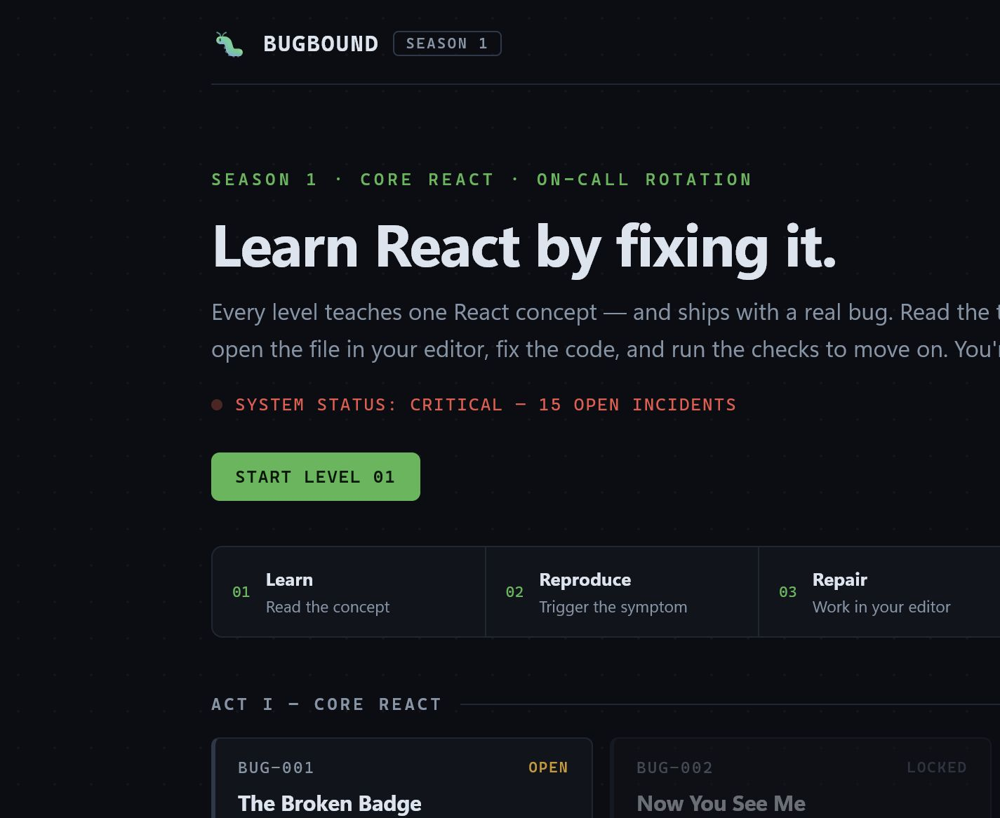
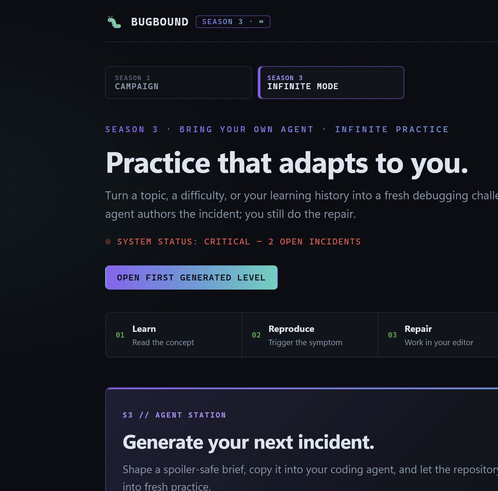

# 🐛 Bugbound

> **Season 3 branch:** the Engineering Lab supports freely chosen, agent-generated challenges with suggested next practice. Season 3 shell components may use npm libraries. beUI's Stateful Button, Action Swap Roll, and Tabs are installed through its official shadcn registry; see [third-party notices](THIRD_PARTY_NOTICES.md), [the design system](DESIGN.md), and `components.json`. Generated exercises retain their separate import restrictions. The original Season 1 overview below is historical context pending the Season 3 documentation audit.

> **Learn React by fixing it.** A level-based debugging game where every lesson ships with a real, intentionally planted bug — and you're the engineer on call.



Bugbound Season 3 is a React Engineering Lab for practice with your own AI coding agent. Choose from generated challenges or revisit **15 foundation levels**. Each investigation gives you a bug report and a live component. Edit the actual source, observe the change, and run the in-app checks. Every challenge is available; the app suggests what to investigate next.

No embedded code editor, no sandbox — you use your real editor, real Vite HMR, and real debugging workflow, because that *is* the skill being practiced.

> **Use a computer for the intended experience.** The interface is responsive, but Bugbound is
> designed for an editor and browser running side by side.

## How it works

Each level has four parts:

| Part | What it does |
|---|---|
| 📘 **The concept** | A short lesson on one React idea (state snapshots, keys, effect cleanup, …) |
| 🐛 **Bug report** | The symptom, QA-ticket style, plus where to look. Early levels name the exact file; later ones just point at a folder |
| 🔬 **Live preview** | The actual buggy component, running. Reproduce the report yourself |
| ✅ **Checks** | An in-browser test harness that mounts the component in isolation, simulates real clicks and typing, and shows pass/fail with readable failure messages |

Progress is saved to `localStorage`. Three escalating hints per level are stored **base64-encoded** (decoded only when you click "reveal"), and [SOLUTIONS.md](SOLUTIONS.md) is encoded too — you can't spoil yourself by accident.

After an incident is resolved, a short post-incident review asks you to explain the mechanism and
the evidence that led to your fix. Check attempts and hint usage are stored locally as a
spoiler-free learning profile for future personalized practice.

## The curriculum

**Act I — Core React (JavaScript):** rendering & JSX · conditional rendering · props · state & immutability · state updates · lists & keys · controlled forms · effect dependencies · effect cleanup · async race conditions · context · memoization & renders

**Act II — The TypeScript Arc:** typing data (the cost of `any`) · typing custom hooks · a multi-bug reducer capstone with discriminated unions

Difficulty ramps two ways: the concepts get more advanced, *and* the bugs get better at hiding.

## Getting started

See the [repository map](docs/ARCHITECTURE.md) for shell ownership, runtime entry
points, protected curriculum paths, tests, and maintenance tools.

Use Node.js `^20.19.0 || >=22.12.0` and npm `^11.16.0` (the lockfile was produced with npm 11.16.0). From a clean checkout, install the locked dependencies and start the app:

```bash
npm ci
npm run dev
```

Open the printed URL to use the Engineering Lab. Before submitting shell or curriculum-tooling changes, run the repository gates:

```bash
npm test
npm run lint
npm run typecheck:components
npm run validate-levels
npm run build
```

## ♾️ Infinite mode: bring your own agent



Open **Create challenge** at any time. Its brief builder turns a topic,
difficulty, and level count into a ready-to-send prompt. You can also download a spoiler-free
learning profile so your agent can target concepts that required more attempts or hints.

Your AI coding agent generates fresh levels — new buggy components, checks, and encoded hints,
in the same style, with the bugs kept secret from you:

> *"Generate two new hard levels about effect cleanup."*

Claude Code picks this up automatically via the bundled `bugbound-levelsmith` skill; any other agent (Cursor, etc.) gets the same instructions from [AGENTS.md](AGENTS.md).

**What your agent does under the hood:**

1. Reads the level contract (manifest shape + check-harness API) and studies an official level for style
2. Designs a realistic component with a planted bug — hints and solution are drafted privately and land in the repo **base64-encoded only**
3. Works on a generation branch and drops the level into `src/levels/custom/` — the game auto-discovers it and makes the first generated challenge playable immediately
4. Proves it both ways: runs the checks against the bug (must fail, readably), against a private fix (must pass) — then deletes the fix
5. Runs `npm run validate-levels`, `npm test`, and `npm run build` as final gates

**Trust but verify:** `npm run verify-level -- <id>` opens a verification route whose checks run
automatically. Ask your agent to show red-before/green-after proof without revealing the fix.

Manage generated content safely:

```bash
npm run custom-levels -- list
npm run custom-levels -- remove 16-some-level --confirm
npm run custom-levels -- reset --confirm
```

## House rules

- **Keep exercise repairs out of `src/shell/`** — that's the game engine. All planted bugs live in `src/levels/`. Shell maintenance requires an explicit, separate request.
- **Don't remove `data-testid` attributes or edit the `checks` in a level's `manifest.js`** — they're the executable spec. *Reading* them when stuck is fair game; that's what reading a failing test at work is.
- If a fix doesn't seem to register after hot-reload, refresh the browser tab and re-run the checks.
- **Keep `main` pristine — it's the game cartridge.** Play on your own branch and commit your fixes there:

  ```bash
  git checkout -b playthrough
  ```

  Your commits become a record of what you learned, and `main` always holds the original buggy state — so `git restore --source=main src/levels/06-musical-chairs/` resets a single level, and switching back to `main` resets the whole game for a fresh run (or for the next player).
- Using an AI assistant? Ask it to **coach, not solve** — the in-app hints exist for a reason.

## Tech notes

- **Vite + React 19**, project CSS, and installed beUI motion components. A static validated catalog drives navigation. Executable exercise manifests load lazily inside disposable frames: one preview frame and a fresh frame for every behavioral check.
- **Behavioral verification** uses native-setter input events and DOM assertions. Rendering, assertions, and cleanup must succeed; checks have an asynchronous deadline and navigation/reset cancels abandoned frames. Use `h.waitFor` for state-specific readiness. Same-origin frames isolate lifecycle and module state; they are not a security sandbox and cannot interrupt a synchronous infinite loop.
- **Saved completion** uses additive, reset-generation-scoped browser records and cross-tab updates. Read, save, and reset failures have separate retries. A run made before progress can first be read must be verified again after recovery. Learning history is non-blocking and reports read/save failures separately.
- **No `<StrictMode>`, deliberately** — the harness counts renders and effect firings, and StrictMode's double-invocation would make honest checks report false failures.
- Levels 13–15 are TypeScript. Vite compiles `.tsx` without type-checking, which is the point: those levels are about bugs that *runtime* tolerates but a well-typed program can't express.

## Roadmap

- **Season 1** *(this repo)* — Core React + TypeScript, 15 levels ✅
- **Season 2** — Next.js edition: hydration mismatches, server/client boundary bugs, caching traps
- **Season 3** *(this repo)* — Bring-your-own-agent infinite mode ✅ — see [AGENTS.md](AGENTS.md) and [CONTRIBUTING.md](CONTRIBUTING.md)

## Credits

Game shell, levels, lessons, and every planted bug authored by Claude (Anthropic), designed collaboratively as a learning project by [Brantley Wyche](https://github.com/Brantley-Wyche). The bugs are modeled on real-world React failure modes you'll meet on the job.

## License

[MIT](LICENSE)
